<picture>
  <source media="(prefers-color-scheme: dark)" srcset="./assets/systems-dark.svg">
  
</picture>

 

**I’m Mauri, a software engineer in Palma de Mallorca.** I design, build and run systems like these end to end — products, platforms, backends and AI agents — for teams and founders who need someone to own the hard part.

Most of my work is private. Ask and I’ll walk you through it.

[mauriruiz.com](https://www.mauriruiz.com) &nbsp;·&nbsp; [me@mauriruiz.com](mailto:me@mauriruiz.com) &nbsp;·&nbsp; [LinkedIn](https://www.linkedin.com/in/mauri-ruiz-b21396138/)
